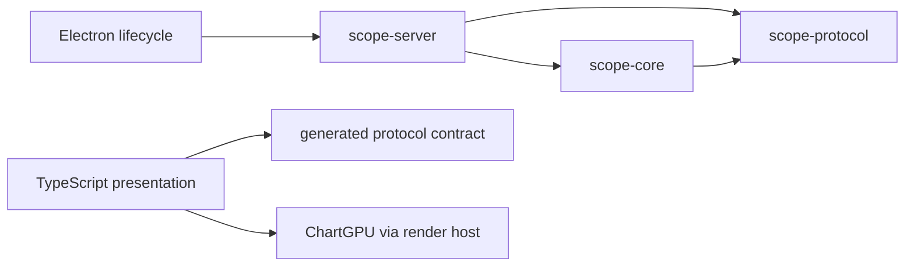

# SignalScope architecture

This is the construction guide: where behavior belongs, who owns state, and
which contracts an implementation must preserve. [ADRs](adr/README.md) record
decisions and alternatives; [the roadmap](implementation-roadmap.md) records
unfinished work. [AGENTS.md](../AGENTS.md) is the short execution guide.

The implementation decisions are recorded in
[ADR 0055](adr/0055-core-policy-and-query-lifetimes.md) and
[ADR 0056](adr/0056-xy-axis-and-bundle-bindings.md), and
[ADR 0057](adr/0057-continuous-line-color-axis.md).

`app/line-bindings.ts` owns X/C binding transitions and source-matched bundle
resolution. `ui/axis-picker.ts` owns searchable axis choices; `ui/axis-drop.ts`
owns drag listeners and their teardown. `app/line-query.ts` queries paired
groups sequentially within each panel and assembles one response without
copying coordinate columns. `snapshot/bindings.rs` owns native capture binding
resolution. Per-series coordinate views keep group-local anchors, X values and
resolution; the existing panel cache charges all retained arrays.

`app/color-scale.ts` owns shared continuous limits and the viridis mapping,
separate from categorical theme colors. `render/color-attributes.ts` caches
aligned RGBA feeds; the ChartGPU fork owns their GPU buffers and interpolation.
`render/colorbar.ts` owns one horizontal scale canvas for both display and
capture. `ui/legend-color-scale.ts` supplies its legend mount through ChartHost;
collapsed legends use a plot inset. Placement never adds a chart gutter or
republishes GPU series. Plot PNGs include an inset independently of the DOM mount.
`ui/panel-axes.ts` owns axis controls and their lifetime; `ui/axis-actions.ts`
coordinates binding changes and scale-only updates through narrow callbacks.

## System boundaries

Arrows below mean **depends on**, not data flow. This is the crate/host boundary;
frontend directories have the more qualified rules below.

Live data travels from Rust through HTTP JSON envelopes or binary frames to
`HttpPlane`. Offline data travels from the baked manifest to `BakedPlane`.
Both feed the same presentation code. Electron starts and presents the server;
it provides no second native data API. Bootstrap selects the plane; views use
capabilities, never host identity.

## Ownership and placement

| Concern                                 | Current owner                                                   | Boundary to preserve                                                                                             |
| --------------------------------------- | --------------------------------------------------------------- | ---------------------------------------------------------------------------------------------------------------- |
| Signal identity and registration        | `scope-core::store`, `sources`                                  | No HTTP, DOM, or source-format knowledge in the store                                                            |
| Column access and page lifetime         | `columns`, `paging`, `bins`                                     | Fallible range access for paged data; a slice may materialize a whole column                                     |
| Decode and admission                    | `ingest`, including `batch`, `admission`, `recipe`, `container` | Decode off the store lock; publish one complete source transaction                                               |
| Reduction                               | `pyramid`, `line2d`                                             | Family-specific extrema, gaps, correspondence, and query quality                                                 |
| Derived data                            | `compute`, `expr`, `derived_bundle`, `derived`                  | Core owns dependency checks, bundle definitions and materialization; API maps core results to protocol summaries |
| Persistence                             | `session`, `preferences`; server selects paths                  | Parse/migrate before applying state; no source samples in sessions                                               |
| Snapshot preparation                    | `snapshot`, `selector`, `tile_wire`                             | Bake selected presentation data and escape the exact HTML injection slot                                         |
| HTTP and process integration            | server `lib`, `api/*`, `auth`, `host`, `dialogs`                | HTTP extraction/framing in API; OS integration at the host edge                                                  |
| Durable frontend workspace              | `app/workspace.ts`                                              | One generated session document; views route mutation intent through callbacks                                    |
| Query scheduling and retained responses | `app/line-presentation-controller.ts`, `tile-window-cache.ts`   | Generation checks, bounded retention, atomic publication                                                         |
| Data preparation                        | `app/plot-capabilities.ts`, `line2d-family.ts`, render adapters | Keep domain interaction separate from renderer-specific publication                                              |
| GPU resources                           | `render/gpu-context.ts`, `chart-host.ts`                        | Shared device context, one chart host per plot, explicit disposal                                                |
| DOM composition                         | `ui/app-shell.ts`, `workspace-view.ts`, `panel.ts`              | Compose narrow consumers; avoid passing a whole owner to an extracted helper                                     |

`host.rs` owns `DataState`, ingest commit, OS integration, and protocol summary
conversion. Its `derived()` method lends core storage, pyramids, budget and
cache location to `DerivedContext`; it does not implement dependency policy.
API children import dependencies directly from their defining modules.

Core dependencies are also more specific than the original five-module sketch:
`store` uses `columns`; `pyramid` uses `store`, `columns`, `bins`, and `paging`;
`compute` and `line2d` consume signal views; `cache` connects storage and
pyramids; `snapshot` orchestrates selection and baking. `session` remains an
independent schema/persistence module. Keep reducers independent of snapshot
and ingest orchestration. Extracting these modules into separate crates would
require an API/visibility review; it is not promised to be mechanical.

## Frontend dependencies and enforcement

The three directories describe responsibilities, not three strictly isolated
layers. These are current production-code boundaries:

| Boundary                                                     | Current evidence / enforcement                                                                                  |
| ------------------------------------------------------------ | --------------------------------------------------------------------------------------------------------------- |
| `app` and `render` do not import `ui`                        | Static import/re-export restrictions in `frontend/eslint.config.js`; tested by `./scripts/test.sh architecture` |
| UI/render do not import concrete `HttpPlane` or `BakedPlane` | Named-import restriction in `frontend/eslint.config.js`                                                         |
| Application presentation code calls render adapters          | Runtime imports in `line2d-family.ts` and `line-presentation-controller.ts`; this is intentional composition    |
| Render code uses application data/math                       | Runtime imports in adapters, overlay, and chart host; these are not all type-only                               |
| Workspace and transport access is concentrated               | `AppShell` owns both; `WorkspaceView` receives `WorkspaceModel`; `ImportWizard` receives `DataPlane`            |
| Frontend packages have no declared runtime dependencies      | `check-runtime-deps.mjs`; this checks package fields, not internal import direction                             |
| Generated files match schemas                                | `pnpm codegen:check` through the frontend script gate                                                           |

Do not widen the existing runtime crossings into arbitrary `app` ↔ `render`
imports. Domain/data helpers must not acquire GPU or UI dependencies. Renderer
hosts must not acquire workspace, ingest, persistence, or concrete transport
dependencies. The presentation composition modules may connect preparation and
adapters. Type-only imports still create schema coupling; they do not justify
sharing a mutable owner.

DOM control construction belongs in `ui`. Canvas/device lifecycle and theme
measurement belong in `render`, even though they use browser APIs. `app` is
not entirely pure: transport, download helpers, and scheduling already use
browser APIs. Classify a new module by the behavior it owns, not by whether it
mentions `window`.

`./scripts/test.sh architecture` checks forbidden and intentional imports
against the effective ESLint configuration and runs in the frontend CI gate.
These static-import checks are distinct from package-dependency checks; they
do not establish general runtime isolation or inspect computed dynamic imports.

## Transactions, requests, and resource lifetime

For changes to these paths, name the owner, publication point, invalidation
event, and failure behavior in the implementation plan.

| Path                   | Ownership and publication                                                                                   | Failure / lifetime                                                                                            |
| ---------------------- | ----------------------------------------------------------------------------------------------------------- | ------------------------------------------------------------------------------------------------------------- |
| Ingest                 | Workers decode and prepare pyramids; `ServerCommitSink::commit` locks state and publishes a complete source | Failed files leave no partial source; committed siblings survive batch failure/cancellation (ADR 0026)        |
| Live paired query      | API clones signal handles under the lock; reduction and encoding happen after release                       | Handle lifetime protects readable input; frontend generation checks reject obsolete results                   |
| Time-tile/sample query | Handlers clone signal and immutable pyramid handles under the mutex, then query and encode after release    | Signal handles retain weakly referenced pyramid inputs; reset/removal cannot revoke active readers            |
| Presentation refresh   | Controller plans density, queries panels, prepares replacements, then swaps the response maps               | Old covering data remains drawable; obsolete generations cannot publish; per-panel query errors remain scoped |
| Response retention     | Each family cache retains an overview and latest detail for a binding identity                              | Binding changes, panel eviction, and workspace replacement must invalidate affected entries                   |
| GPU presentation       | `PanelView` owns `ChartHost`; host owns ChartGPU registration/publication/disposal                          | Keep one host per plot; test late initialization and disposal when changing lifecycle                         |
| Restore/save           | Server restore gate protects autosave; shell applies the restored session and refreshes presentation        | Validate supported versions first; restore finalization must settle on success and failure                    |

The refresh token prevents stale publication, including for transports that
ignore cancellation. Query methods also accept an optional `AbortSignal`:
`HttpPlane` cancels fetch and `BakedPlane` checks before preparation. The
controller's `clear()` cancels scheduled work and invalidates retained state;
`dispose()` additionally prevents reuse. Non-persisted page teardown stops
presentation and releases chart hosts before the GPU device. Fetch cancellation
does **not** cancel a Rust blocking task that has already started.

Derived spills use unique files whose ownership is shared by cloned page
handles. Removal/reset releases the store's ownership; the last reader deletes
the file. Persistent ingest caches do not use this temporary-file policy.
Fallible derived value preparation precedes replacement, preserving an old
definition when spill IO fails.

Budgeting must cover more than retained tiles: source-window materialization,
concurrent requests, temporary reduction buffers, prepared feeds, and GPU
publication can overlap. Explicit-X timebase comparison can scan complete
columns when timebase IDs differ, even for a small viewport. Its padded window
limits the selected range, not a fixed number of samples or bytes. Benchmark
large windows and gap-heavy data before adding caching or concurrency.

## Contracts and compatibility

Schema sources are `protocol/schema/scope-{protocol,session,preferences}.json`.
Run `pnpm codegen`; never edit generated Rust or TypeScript. Choose `object`
for independent fields, `enum` for a closed set, and `tagged_union` for
correlated variants such as `SampleAxisSource`.

Generated types protect typed construction, not arbitrary input. Rust Serde,
binary decoders, `parseBakedSession`, and preferences parsing own runtime
checks. A TypeScript cast does not validate JSON. A tagged union eliminates
one structural ambiguity; it does not prove referenced signals exist, ranges
are valid, or X/Y timebases agree.

| Contract                      | Version / compatibility owner                                     | Required evidence when changed                                                               |
| ----------------------------- | ----------------------------------------------------------------- | -------------------------------------------------------------------------------------------- |
| HTTP JSON and binary payloads | Protocol schema, envelope and frame codecs (ADR 0004, 0036, 0052) | Additive defaults or explicit version compatibility; Rust/TS codec and malformed-input tests |
| Durable sessions              | `session::from_json`, ordered `MIGRATIONS` (ADR 0005)             | Each supported old version advances to current; unsupported versions fail before restore     |
| Baked sessions                | `app/baked-session.ts`, shipped with matching snapshot runtime    | Current-version validation; no duplicate frontend migration ladder                           |
| User preferences              | Rust and TS preferences parsers (ADR 0023)                        | Preferences migration/default tests; preserve unreadable future files                        |
| Snapshot payload              | Manifest schema plus Rust bake and `BakedPlane` readers           | Captured bindings, range/fidelity, offline zoom limits, size and injection checks            |

These are separate version domains. A protocol change does not go in the
session migration table. A release version is separate again; an existing
synchronized PR bump is not repeated for documentation follow-ups.

## Adding behavior

Start with one concrete use case and an observable acceptance criterion. Trace
it through the owners above before choosing new interfaces. Use the
[ADR template](adr/template.md) for a durable boundary, compatibility,
reduction, or resource-policy decision; ordinary local changes need only a
short implementation plan.

### Endpoint or data-plane capability

1. Classify it as a presentation read or an optional live operation.
2. Define types and defaults in the appropriate schema; regenerate outputs.
3. Put data semantics in core and HTTP validation/framing in the matching
   `api/*` module; register the route in server `lib.rs`.
4. Presentation reads used by captured plots need `HttpPlane` and `BakedPlane`
   semantics. Define what unavailable or uncaptured data means offline.
5. Ingest, native save, restore, preferences, and native export use nullable
   ports. `BakedPlane` intentionally exposes these as `null`; do not add fake
   implementations or host detection to satisfy a blanket parity rule.
6. Test the owning behavior and the boundary that can disagree: codecs,
   live/baked reads, failure publication, or persistence compatibility.

### Another plot or data family

Plot content, reduction family, and renderer family are different choices.
Time envelopes and paired explicit-X data already share Line2D rendering.
A future compute producer may also feed that model without being a new
renderer. A raster or 3D scene must not be forced into Cartesian line types.

Before implementation, decide the coordinate/interaction semantics, reduction
invariant, typed payload, durable state, snapshot range/fidelity, and resource
cost. Reuse an existing contract only if those meanings match. Otherwise add
the typed family endpoint and payload per ADR 0052. Do not use a universal
untyped `queryPlotData` response.

`PreparedPlot` currently describes Cartesian line interactions; it is not a
promise that every future plot implements that interface. `WindowResponseCache`
is private to its module and shared by the two current cache implementations;
reuse requires matching coverage, quality, and retention semantics, not merely
adding a subclass. `PanelShell` is a reuse candidate for chrome. Legend geometry
is reusable where its interaction contract fits, not guaranteed unchanged for
every plot.

Add a panel-content session union only with the second concrete content type.
Build one vertical slice through live data, presentation, persistence, and bake
before extracting a generalized family registry. Estimate cost from required
algorithms and validation; historical lines of code are not an engineering
budget.

## Shared primitives and extraction

Before adding a helper, inspect these owners and their tests.

| Need                                        | Existing implementation                                                          |
| ------------------------------------------- | -------------------------------------------------------------------------------- |
| Required DOM slots, pointer capture         | `ui/dom.ts`: `required`, `requiredSlot`, `bindPointerDrag`                       |
| Panel chrome and status                     | `ui/panel-shell.ts`                                                              |
| Legend geometry and docking                 | `ui/legend-rail.ts` via `LegendRailHost`                                         |
| Statistic cells, spans, CSV/download        | `ui/legend-stats.ts`                                                             |
| Series property inspector                   | `ui/series-inspector.ts`; value inputs and close/mute/patch callbacks            |
| Panel configuration menu lifecycle          | `ui/panel-menu.ts`; keyboard navigation, dismissal and teardown                  |
| Shell command metadata                      | `app/shell-commands.ts`; composition supplies live actions and capability checks |
| Window retention                            | `app/tile-window-cache.ts`                                                       |
| Density and memory estimates                | `app/presentation-budget.ts`                                                     |
| Picking, cursor, annotation, stats          | `app/plot-capabilities.ts`                                                       |
| Current Line2D preparation/adapter dispatch | `app/line2d-family.ts`                                                           |
| Render axes, strokes, immutable feed cache  | `render/line2d-adapter.ts`                                                       |
| Range math and clamping                     | `app/plot-math.ts`                                                               |
| Series color slot                           | `render/plot-theme.ts`: `hueIndex`                                               |
| Sorted numeric search                       | `app/binary-search.ts`                                                           |
| Padded slice window                         | `scope-core::time_window`                                                        |
| Paged column window                         | `scope-server::host::windowed_slice` (fallible; not the slice helper)            |
| Snapshot selectors                          | `scope-core::selector`; recipe globs have different path semantics               |

Extract around an invariant, independently testable behavior, or resource
lifetime. A single-consumer module can be useful for any of those reasons.
Moving methods into another file while passing the entire owner or importing
all dependencies through the parent leaves the coupling intact. Prefer direct
imports from defining modules; keep parent facades for deliberate public APIs.

Use existing UI patterns: fixed markup with required slots, imperative rows,
narrow host ports, controllers, and callbacks for upward intent. A new pattern
needs a concrete reason, not a blanket prohibition or a speculative framework.
Move behavior tests with their owner; integration tests may stay at the
composition root. Shared fixtures should expose meaningful variations and keep
each test's behavioral inputs visible.

ADR 0053 sets a soft 600-line budget and requires a split before adding behavior
to modules above 1,000 implementation lines (excluding Rust inline tests).
This is a review trigger, not proof of cohesion. `workspace.ts` is not exempt.
The current partial extractions leave `panel.ts` and `app-shell.ts` above the
limit: they remain restricted. Further work must either extract the behavior
into a cohesive owner or explicitly amend the ADR with a bounded exception.
Documentation/bug fixes do not require an unrelated repository-wide split.

## Validation and handoff

| Changed behavior                            | First evidence                                                                    |
| ------------------------------------------- | --------------------------------------------------------------------------------- |
| Ingest, storage, reduction, expressions     | `./scripts/test.sh core [filter]`                                                 |
| HTTP, host state, native persistence        | `./scripts/test.sh server [filter]`                                               |
| Application, adapters, publication          | `./scripts/test.sh unit [file]`                                                   |
| Schema/codegen or snapshot contract         | `./scripts/test.sh frontend` plus affected Rust tests                             |
| Desktop interaction, layout, offline export | Playwright via `./scripts/test.sh e2e`, after implementation                      |
| Resource or reduction policy                | Relevant `./scripts/test.sh bench` mode, with corpus and measured bounds reported |

Browser tests enable Chromium’s headless GPU presentation and share the
SwiftShader ANGLE Vulkan context with the compositor. A separate GL/software
presentation path can lose WebGPU canvas devices even after initialization
succeeds. CI stops after the first test exhausts its retries and uploads failed
browser traces for diagnosis.

Viewport updates change ChartHost's domains and layout immediately; the shared
`GpuContext` frame loop draws the latest state once per animation frame.
Capture explicitly flushes pending work. Line2D preparation caches only the
finite paired extents, with one WeakMap entry per immutable Y column keyed by
X/anchor identities and source-time window. Replacing any input invalidates the
entry; releasing the Y column makes it collectible. No extra sample or GPU
buffers are allocated. The ChartGPU fork draws each standard line segment as
an independent four-vertex strip with the same two triangles and source rows.
See [rendering performance](rendering-performance.md) for measurements and
pixel-equivalence coverage.

After narrow tests, use a proportional gate; cross-layer implementation uses
`./scripts/ci.sh all`. Documentation-only work needs formatting, reference
checks, and `./scripts/version.sh check`, not GUI or reducer tests. Report
actual commands and limitations. `version.sh check` proves version agreement,
not whether a release is semantically breaking.

The roadmap owns pending work and completion criteria. When a seam moves,
update this guide and that entry. ADRs retain the decision and its tradeoffs;
do not keep separate rolling line-count inventories in all three places.
