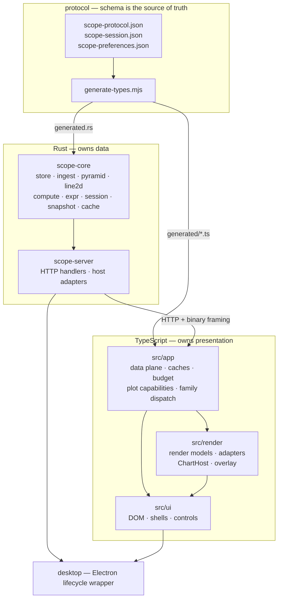
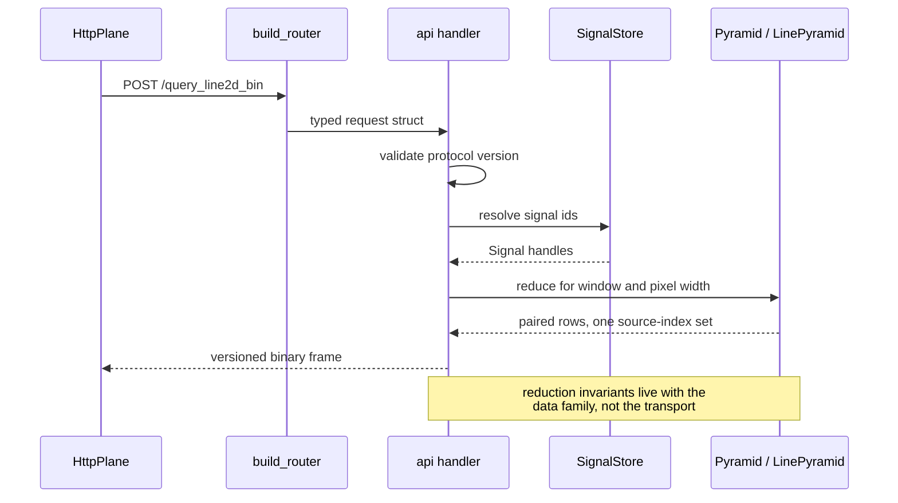
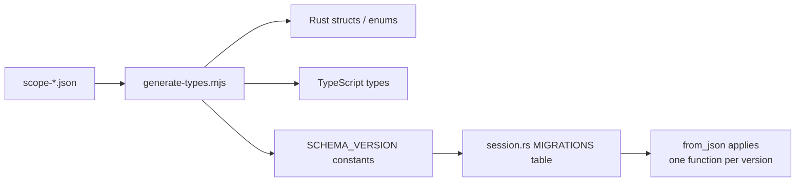
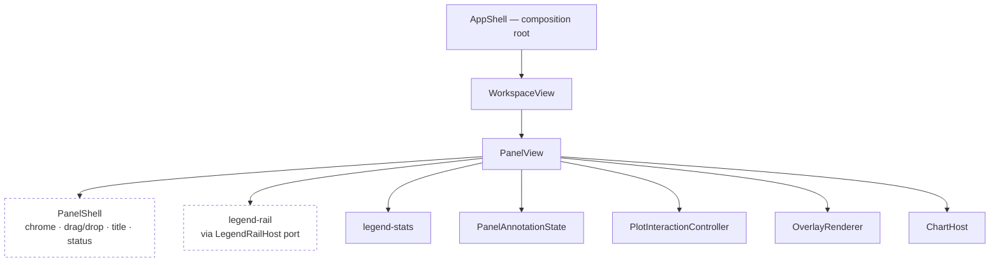
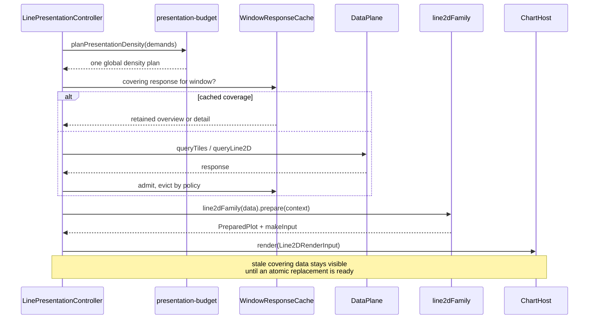
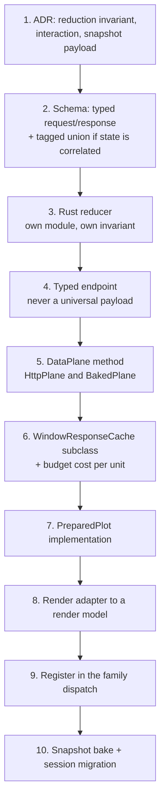

# SignalScope architecture

This is the construction guide for the repository. [ADRs](adr/README.md) record
_why_ a decision was made; this document records _where code goes_ and _what to
reuse_ so an implementer does not have to rediscover either.

Read this with [AGENTS.md](../AGENTS.md) (rules) and
[implementation-roadmap.md](implementation-roadmap.md) (current scope).

## System map

## Dependency rules

These are enforced by review, and they currently hold with no exceptions.

| Rule                                                                    | Status |
| ----------------------------------------------------------------------- | ------ |
| `src/render` never imports `src/ui`                                     | holds  |
| `src/app` never imports `src/ui`                                        | holds  |
| Only `app-shell`, `workspace-view`, and `import-wizard` reach app state | holds  |
| `scope-core` never depends on `scope-server`                            | holds  |
| Frontend never branches on host identity (Electron vs browser)          | holds  |
| Generated files are outputs, never hand-edited                          | holds  |

`src/ui/app-shell.ts` is the composition root: it is the one module allowed to
know about `WorkspaceModel`, `DataPlane`, and the DOM at the same time. Every
other UI module receives a narrow port or callback interface instead.

## Backend

### Crate map

| Module               | Owns                                              |
| -------------------- | ------------------------------------------------- |
| `store`              | signals, sources, transactional registration      |
| `ingest`             | streaming decoders, batch jobs, recipes           |
| `pyramid`            | time-envelope min/max reduction (`EnvelopeBin`)   |
| `line2d`             | paired X/Y reduction (`LinePyramid`, `LinePoint`) |
| `compute`            | derived-signal materialization                    |
| `expr`               | expression lexing, parsing, evaluation            |
| `session`            | schema versioning, ordered migrations             |
| `snapshot`           | export planning, baking, HTML injection           |
| `selector`           | snapshot selector parsing and character globs     |
| `cache`              | on-disk sidecars, paging, column codecs           |
| `scope-server::api`  | HTTP handlers, one per operation                  |
| `scope-server::host` | OS dialogs, filesystem, process concerns          |

Dependencies point inward. `snapshot` may call `pyramid` and `line2d`; neither
may call `snapshot`.

### Request lifecycle

### Adding an endpoint

1. Add the request/response types to `protocol/schema/scope-protocol.json`.
2. Run `pnpm codegen`. Never hand-edit `generated.rs` or `generated/*.ts`.
3. Add the handler to the matching `api` module (see the split in
   [ADR 0053](adr/0053-module-boundaries-and-shared-primitives.md)).
4. Register the route in `scope-server/src/lib.rs`.
5. Add the method to the `DataPlane` interface **and to both implementations** —
   `HttpPlane` and `BakedPlane`. A capability that only works online is a bug,
   not a limitation.
6. Add Rust handler tests and TypeScript data-plane tests.

## Schema and codegen

The generator supports three constructs. Choose deliberately:

| Construct      | Emits                                   | Use when                |
| -------------- | --------------------------------------- | ----------------------- |
| `object`       | struct / interface                      | fields are independent  |
| `enum`         | unit enum / string union                | a closed set of names   |
| `tagged_union` | serde-tagged enum / discriminated union | fields are _correlated_ |

**Correlated fields are a tagged union, not an object with nullable fields.**
`XAxisSource` is the reference example: the `time` variant carries no reference
and the `signal` variant requires one, so the invalid pairing cannot be
constructed in either language and no hand-written validator is needed.

Schema changes follow ADR 0005: additive fields need defaults; anything else
needs a version bump plus one migration function appended to `MIGRATIONS`. Each
migration advances exactly one version and sets the next `schema_version`.

## Frontend

### Three-directory rule

| Directory    | Contains                          | May import                         |
| ------------ | --------------------------------- | ---------------------------------- |
| `src/app`    | data, caches, policy, pure logic  | `app`, `render` types, `generated` |
| `src/render` | render models, adapters, GPU host | `app` types, `generated`           |
| `src/ui`     | DOM construction and events       | everything                         |

If a module needs the DOM it belongs in `ui`. If it needs only data it belongs
in `app`. If it converts a transport response into something a renderer accepts,
it belongs in `render`.

### UI construction patterns

Five patterns are in use. Pick the one that matches; do not invent a sixth.

1. **Markup string plus slot lookup** — for fixed chrome. `panelShellMarkup()`
   emits `data-panel-slot` attributes and `requiredSlot()` resolves them.
   Throwing on a missing slot turns a template typo into a startup failure
   rather than a silent null.
2. **Imperative element building** — for repeated rows built from data (legend
   rows, menu items, stat cells).
3. **Host port** — a module that needs to read and commit state declares a
   narrow interface and receives it. `LegendRailHost` is the model: the rail
   module never sees `PanelView`, only the seven members it actually reads and
   commits. **This is the pattern that makes a module reusable by a future
   panel type.**
4. **Controller object** — owns behavior over an element plus callbacks:
   `PlotInteractionController`, `LinePresentationController`, `OverlayRenderer`,
   `ChartHost`.
5. **Callback interface** — views never mutate the workspace. `PanelCallbacks`
   and `PanelShellCallbacks` route intent upward to the composition root.

### Panel composition

Dashed modules are family-agnostic: a future scatter or histogram panel composes
them unchanged. `PanelShell` deliberately knows nothing about signals, axes,
statistics, or ChartGPU.

### Presentation pipeline

Two seams carry the polymorphism:

- **`PreparedPlot`** (`app/plot-capabilities.ts`) — auto-ranges, cursor, hit
  testing, annotation resolution, statistics. Panel code calls the interface.
- **`Line2DRenderInput`** (`render/line2d.ts`) — the renderer-owned model.
  `ChartHost` accepts only this; it does not know about tiles or timebases.

## Adding a plot family

Rules that fall out of ADR 0052 and are easy to get wrong:

- Reduction invariants belong to the family. Transport machinery (framing,
  cancellation, pixel-width quality, stale retention, atomic publication) is
  shared. Do not merge the two.
- A new family gets its **own endpoint**. Never widen an existing response into
  a loosely typed universal payload.
- The offline path is not optional. A family that cannot be baked into a
  snapshot is not finished.
- Cartesian families may reuse `Line2DRenderInput`. Raster/grid and 3D content
  need their own render model; they share `PanelShell` and the resource
  lifecycle, not a forced Cartesian abstraction.
- Budget: expect roughly two thousand lines of Rust for a genuinely new
  reducer, transport, endpoint, and snapshot path. The presentation layers are
  cheap; the data layers are not.

## Shared primitives

Before writing a helper, check this table.

| Need                                     | Use                                                |
| ---------------------------------------- | -------------------------------------------------- |
| Resolve a required DOM node              | `ui/dom.ts` → `required`, `requiredSlot`           |
| Pointer-capture drag                     | `ui/dom.ts` → `bindPointerDrag`                    |
| Panel chrome, drag/drop, status states   | `ui/panel-shell.ts`                                |
| Legend rail geometry and docking         | `ui/legend-rail.ts` via `LegendRailHost`           |
| Statistic cells, spans, CSV, download    | `ui/legend-stats.ts`                               |
| Windowed response retention              | `app/tile-window-cache.ts` → `WindowResponseCache` |
| Density and memory planning              | `app/presentation-budget.ts`                       |
| Plot picking, cursors, stats             | `app/plot-capabilities.ts` → `PreparedPlot`        |
| Family dispatch                          | `app/line2d-family.ts`                             |
| Render-model construction, strokes, axes | `render/line2d-adapter.ts`                         |
| Interleaved feed caching                 | `render/line2d-adapter.ts` → `createFeedCache`     |
| Range math, clamping                     | `app/plot-math.ts`                                 |
| Series color slot                        | `render/plot-theme.ts` → `hueIndex`                |

## Module size budget

Soft budget **600 lines** per module; **1,000 lines triggers a split** before new
behavior is added. Rust files are measured on implementation lines, excluding
the inline `#[cfg(test)]` module.

Current state, measured after the first ADR 0053 burn-down pass:

| File                                  | Lines | Impl | Status                                 |
| ------------------------------------- | ----- | ---- | -------------------------------------- |
| `frontend/src/ui/app-shell.ts`        | 3,547 | —    | mount staged; command registry remains |
| `frontend/src/ui/panel.ts`            | 3,452 | —    | legend and menu extractions remain     |
| `frontend/src/styles/app.css`         | 3,244 | —    | split remains                          |
| `core/scope-core/src/snapshot.rs`     | 1,406 | 672  | selector engine extracted              |
| `frontend/src/app/workspace.ts`       | 1,266 | —    | cohesive data model; do not split      |
| `core/scope-core/src/cache.rs`        | 1,180 | 745  | byte-layout codec extracted            |
| `core/scope-core/src/ingest/batch.rs` | 1,127 | 23   | test-only; not a violation             |
| `server/scope-server/src/api/*.rs`    | ≤521  | —    | split by endpoint concern              |
| `core/scope-core/src/pyramid/*.rs`    | ≤568  | —    | split into build/query/synthesis       |
| `core/scope-core/src/expr/*.rs`       | ≤471  | —    | split into lex/parse/eval              |

The split plan and the duplication inventory are recorded in
[ADR 0053](adr/0053-module-boundaries-and-shared-primitives.md).

## Test map

| Layer                                                  | Tool       | Lives in                      |
| ------------------------------------------------------ | ---------- | ----------------------------- |
| ingest, time, pyramids, protocol, session, expressions | Rust tests | inline `#[cfg(test)]`         |
| application, renderer, snapshot behavior               | Vitest     | `*.test.ts` beside the module |
| desktop interaction, layout, export boundaries         | Playwright | `frontend/tests/e2e`          |

Behavior changes need behavior tests. When code moves between modules, its tests
move with it — a refactor that drops coverage is not a refactor.

Run the narrowest affected suite first, then a gate proportional to the change.
`./scripts/ci.sh all` is for cross-layer work. See AGENTS.md for the script API.
