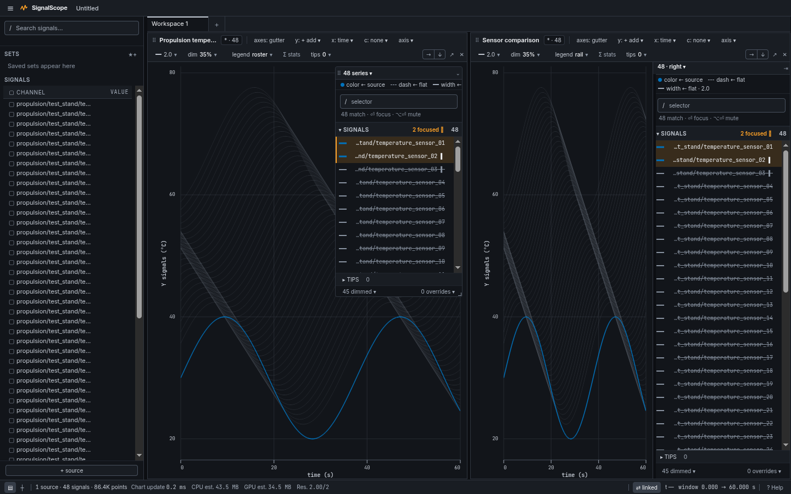
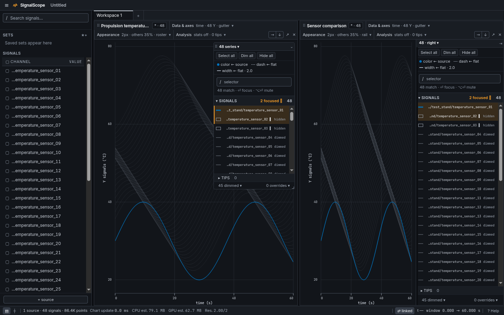

# Plot UI refinement review

These captures show the same 48-signal workspace (86,400 samples) in the running
application, using visible Chromium at device scale 1. The left legend floats;
the right legend is docked. Signals 1 and 2 are focused, signals 2 and 3 are
hidden, and the other visible signals are dimmed to 35% by the existing rule.

| Workspace                      | Before                                                 | After                                                 |
| ------------------------------ | ------------------------------------------------------ | ----------------------------------------------------- |
| 1440 × 900; UI 13px, plot 9px  | [Native scale](before-native.png)                      | [Native scale](after-native.png)                      |
| 1100 × 900; UI 18px, plot 13px | [Larger fonts, narrow panels](before-large-narrow.png) | [Larger fonts, narrow panels](after-large-narrow.png) |

Panel configuration now uses Data & axes, Appearance, and Analysis dropdowns
with visible summaries, following the subsequent review. Assignment and axis
controls moved into Data & axes; width, dimming, and legend presentation moved
into Appearance; statistics and tips moved into Analysis. Title, bindings, and
layout actions stay outside. Existing setting pickers retain their actions and
return focus to the group trigger. `c:` reads `color:`, `axis` reads `limits`,
and the width sample has a text label. Long paths preserve their distinguishing suffixes
and expose their full names in tooltips. The
[control inventory and typography details](../../frontend/src/styles/README.md#plot-readability)
document the changes.

After review, legend signal text follows the plot font size, capped at the small
UI caption size: 9px by default and at most 11px at the default UI size, even
when plot text is enlarged. Increasing the UI size still allows larger legends.
Expanded floating and docked legends use compact bordered buttons in the UI font for
Select all, Dim all, and Hide all directly above the encoding controls. These
become Clear selection, Undim all, and Show all when applicable. They affect all
assigned signals, including filtered rows. Hide and Dim preserve selection;
Undim all restores full opacity and disables the dim-other-traces rule. The
toolbar labels that separate rule `dim others`. Each bulk action is one undo
step and uses the existing serialized focus and override fields.

Hidden and dimmed states have separate indicators; focus remains additive and
does not alter visibility. Narrow legends use hollow/half-circle symbols with
tooltips. The existing dim-non-focused rule still responds to focus. Compact
keys remain available, while font changes now resize legend text and keep the
signal browser's virtual rows aligned. Statistics headers follow horizontal
scrolling and share column widths with values.

`frontend/tests/e2e/ui-refinement.spec.ts` creates the captured workspace and
checks focus, hidden and dimmed states, keyboard selection and restore,
enlarged typography, toolbar access, virtual scrolling, and statistics alignment.
Run it with `./scripts/test.sh e2e ui-refinement.spec.ts --workers=1 --headed`.
Captures are written to `build/ui-review/` and attached to the test results.
To repeat the baseline capture, serve the base revision on port 4174 and set
`SIGNALSCOPE_UI_CAPTURE=before` for the same test command.

## Validation status

The frontend gate passed all 2,869 tests, lint, generated-schema checks, build,
and snapshot artifact checks. The affected browser run passed 28 checks,
including toolbar keyboard navigation, dense signal states, enlarged fonts,
floating and docked legends, linked axes, cursor modes, and workspace layouts.

Three browser checks required follow-up: Help passed on rerun; the explicit-X
test passed after updating its limits-editor anchor and focus expectations to
the visible Data & axes trigger. Theme cycling still failed on rerun. Theme
shortcut handling was not changed by this patch. Validation used visible
Chromium, not a packaged Electron build.
